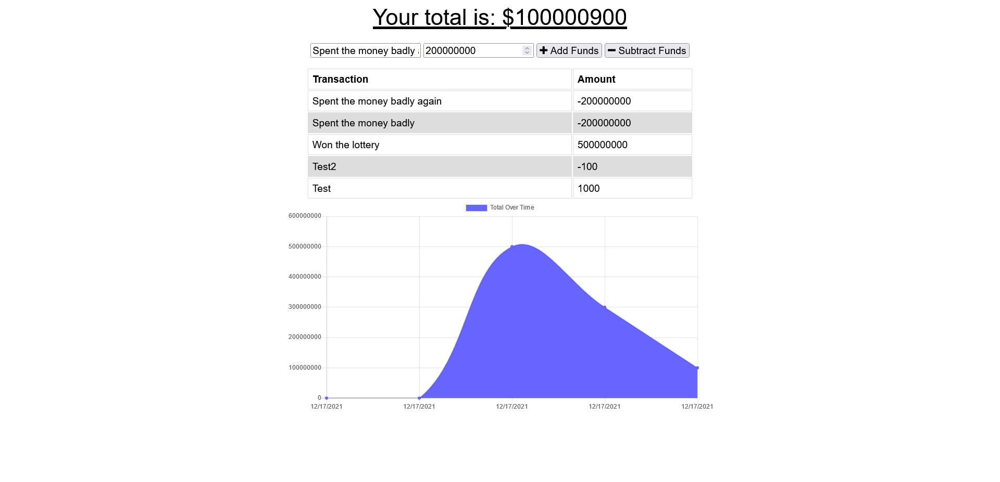

# Budget Tracker 

## Table of Contents

- [Installation](#installation)
- [Description](#description)
- [URLs](#urls)
- [Usage](#usage)
- [Images](#images)
- [Credits](#credits)
- [License](#license)
- [Contributions](#contributions)
- [Tests](#tests)
- [Questions](#questions)

## Installation

To install this application you will need to have nodeJS use npm install to get all the related packages for this project. Furthermore, in the terminal type npm start to get the application running. If for some reason webpack has not already installed the manifest.json file and app.bundle.js you will want to end the server, run npm build, and then npm start.

## Description

This a web application that can be used to track your expenses.

## URLs

GitHub repository: https://github.com/ajlineb/Proggressive-Budget-Tracker

Webpage: https://budget-tracker-0-1.herokuapp.com/

## Usage

This application can be both used while online or offline at your convience. It will save your enteries while offline and push them to the database when back online.So this application can be quite nifty on the go and keeping an eye on how you spend throughout your day!

## Images

## Credits

UNC Chapel Hill for starter code.

## License

MIT License

## Contributions

Please send an email with ideas!

## Tests

n/a

## Questions

Contact by:  
GitHub Username: [ajlineb](https://github.com/ajlineb)  
Email: anthonylinebaugh95@gmail.com
